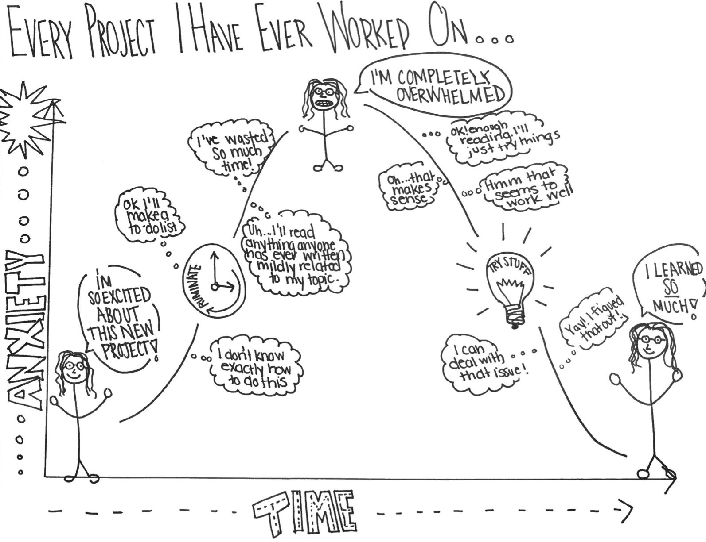
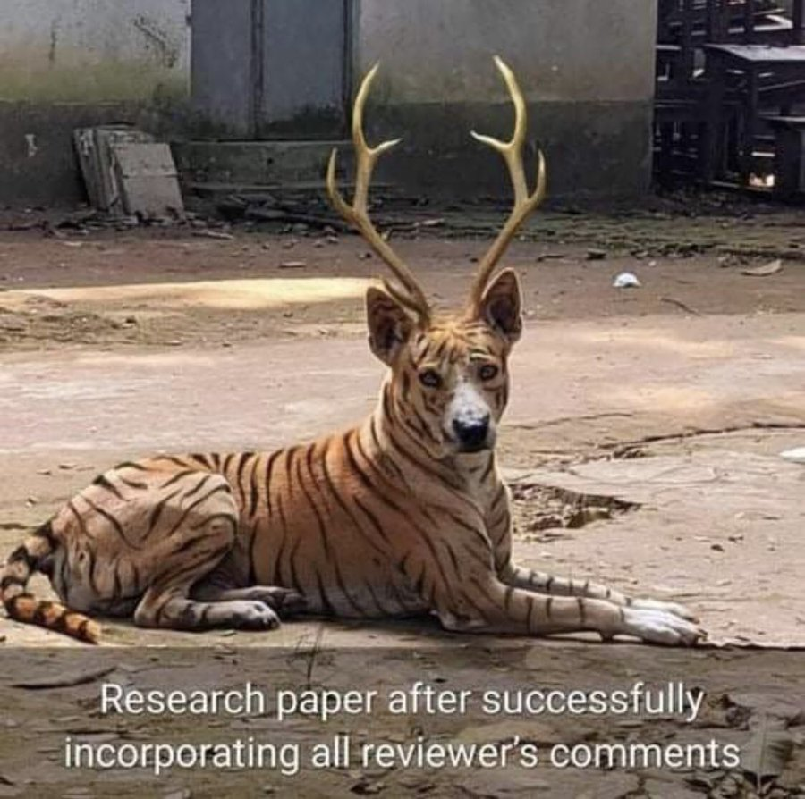

```{r echo=FALSE}
# This removes all items in environment. 
rm(list=ls())
```

\newpage

# `r fontawesome::fa("user-edit")` Writing style.

Writing should be a constant process – start now – do not wait until you have done all your research. Also, remember you must be prepared to edit your writing several times before it is ready. 

The writing style is important because you might have a great idea but if you fail to communicate effectively nobody will take you seriously. Alternatively, you might have a regular idea but you are very convincing and you communicate it very well then everybody will listen to you. This section can help you understand the required writing style you have to use in your project.

Group projects can provide particular interpersonal challenges, as teams cope with difference of views, non-performing team members etc., and particular problems can arise at the writing stage. If you split up the sections among different people, then you will get different writing styles and even ideas about what the report is about. Ways of ensuring consistency includes swapping around writing and editing, so that the text gets seen by a different pair of eyes, or having an overall ‘master editor’.

**Avoid using several and mixed verb tenses.** I recommend you to use the simple present tense in most of your document. Keep the writing simple, straight, and clear. Complicated writing is often confusing. Sometimes the student thinks that a complex text is more formal or elegant and this is the opposite. Complex writing makes you sound small-minded. Simpler text is often more difficult to achieve but it is preferred in terms of clarity. Use past and future tense only in very limited cases and avoid contractions.

Mixed Verb Tenses:
By the time you finish your dissertation, you will have learned so much, and you might have been reflecting on the journey that has brought you here, which started years ago when you first decided to pursue this degree. This mixture of past, present perfect, and future tenses can confuse readers and obscure the timeline of events.

Simple Present Tense:
You learn a lot during your dissertation, and you reflect on the journey that starts when you decide to pursue this degree. Using the simple present tense keeps the timeline clear and makes the message easier to understand.

**Use the active voice.** In English, readers prefer the SVO sentence sequence: subject, verb, object. This is the active voice. For example: Passive sentences bore people. When you reverse the active sequence, you have the OVS or passive sequence: object, verb, subject. For example: People are bored by passive sentences. You cannot always use the active voice, but most writers should use it more often. In short, the more you read the better you write. In academic writing this applies very well, your writing will improve considerably if you consciously read high quality published papers. My recommendation is to use active voice.

Passive Voice:
The results of the experiment were analyzed, and conclusions were drawn based on the data collected, which was then presented in the report. This passive construction can obscure clarity and make it unclear who performed the actions.

Active Voice:
We analyzed the results of the experiment, drew conclusions based on the collected data, and presented them in the report. Using active voice clarifies who performed the actions and makes the writing more direct and engaging.

**Detail.** You are expected to write detailed explanations of what you are doing in your project. Most of the times when I review your drafts, I insist on this point several times. You must motivate and introduce every idea, explain it fully, elaborate on the nature of your objectives, and be very explicit in your methodology. You must show how well you understand the topics in your project and a detailed discussion helps you to achieve this objective. Consider the following example: (1) I grow lots of flowers in my backyard; (2) I grow 34 varieties of flowers in my backyard, including pink coneflowers, purple asters, yellow daylilies, Shasta daisies, and climbing clematis. Clearly (2) is more interesting than (1) simply because more details are provided and I can even imagine your backyard very clearly.

**Clarity.** This refers to the quality of coherence and intelligibility. You need to make sure your idea is clearly communicated. Sometimes sentences and paragraphs are not very well connected and this leads to some confusion about what is your main point. In this case, you will have to review your text and make sure every single sentence and paragraph are effectively contributing to communicating the idea correctly. Write use instead of utilize, near instead of close proximity, help instead of facilitate, for instead of in the amount of, start instead of commence.

**Paragraph structure.** A good paragraph contains only one major point of discussion. All the sentences in the paragraph should relate to this one idea and should flow from one another. If you read one sentence aloud and you need to pause for breath, insert a comma.

**Write clear sentences.** One golden rule for clarity is that a sentence should be easy to understand the first time you read it. If it is not, then think about restructuring it or splitting it in two.

**Avoid illogicalities and errors in reasoning.** These include contradicting something you said in one paragraph in the next (or even the same paragraph), complete jumps of sense between or within paragraphs, so that one statement does not follow on from another, deducing incorrect conclusions from evidence.


**Avoid wordiness.** Delete any words which do not add to the meaning. Some words may be correct grammatically, but they do not really add anything to the sentence.

Reduce wordy verbs.

-	From *is aware, has knowledge of*, to simply: *knows*.
-	From *is taking*, to simply: *takes*.
-	From *are indications*, to simply: *indicate*.
-	From *are suggestive*, to simply: *suggests*.

**Coherence.** This is about being logical and consistent in your writing. It is worthwhile to constantly question yourself whether your paragraph or section makes sense or not. If not, you will have to work on your coherence. Coherence is about confirming that the structure of your manuscript is logical and your meaning is clear. 

**Cohesion.** This is about forming a united whole. Sometimes four team members contribute to writing a specific section and it turns out that the section lacks of cohesion because it looks as different views and unarticulated paragraphs. You will have to make sure your text is in fact a unity. Words and phrases can control and order the logic within a paragraph's argument. You can link ideas using words that show a logical relationship: therefore, however, but, consequently, thus, even so, conversely, nevertheless, moreover, in addition, and many more. Whatever its form, an intra-paragraph transition should be unobtrusive, shifting readers easily from one topic to the next. 

**Flow.** Your reader should be able to follow your line of discussion, see how you are moving your discussion from one topic to the next in developing your overall point of view. In other words, paragraphs should be properly linked to ensure coherence. 

There is an interesting and relevant recommendation by Gary Provost about academic writing. This summarize very well how you are expected to write:

*This sentence has five words. Here are five more words. Five-word sentences are fine. But several together become monotonous. Listen to what is happening. The writing is getting boring. The sound of it drones. It’s like a stuck record. The ear demands some variety. Now listen. I vary the sentence length, and I create music. Music. The writing sings. It has a pleasant rhythm, a lilt, a harmony. I use short sentences. And I use sentences of medium length. And sometimes, when I am certain the reader is rested, I will engage him with a sentence of considerable length, a sentence that burns with energy and builds with all the impetus of a crescendo, the roll of the drums, the crash of the cymbals–sounds that say listen to this, it is important.*


# `r fontawesome::fa("bullhorn")` Presentation.

In the same way that your thesis or journal article should have a clear argument, a good presentation needs a clear message and an efficient vehicle to transmit this message in a few minutes (usually 30, maximum 45 minutes). This key message provides the focus for your presentation and gives it the structure. Having a clear message helps you to communicate more effectively and takes the focus away from merely delivering information. A visual representation of your ideas can enhance your audience’s understanding of your points, provide a point of interest and create a more lasting impact than oral input alone. You should never let your visual aids replace good content.

The structure of the thesis presentation is normally different from the research paper structure explained above and that is fine. The structure of the PowerPoint presentation can incorporate some innovative approach to help the team to explain the project more effectively, efficiently, creatively and innovatively. This innovative approach could also include some changes in the original Word document structure. The fact that you have about 30 minutes to do the final presentation represents a time constraint that you will have to overcome with a very well-designed presentation.

My recommendation is not to innovate too much in terms of formatting and animations, you should rather innovate in terms of contents and the way you communicate and explain your results better (you can always find a better way to explain things). I also normally recommend you to follow a more graphical approach and avoid writing too much text in your presentation. People listening to your presentation are not supposed to read what you are saying, it is torturing to do that. The point here is that you are supposed to design slides that can help you to explain, rather than full text slides. The ability to clearly explain a lot of work in a limited amount of time is very valuable in the job market and we normally develop this skill while doing research.

Some common mistakes in the earlier drafts of the PowerPoint presentation includes:

**Excessive animations.** Animations are OK if they are really necessary. My advice here is to be innovative in the way you present your work, not in the way you add animations. 

**Too many slides.** My advice here is to keep it short or at least as short as you can. Make every slide count. Be critical here and ask yourself if that slide really adds value. Remember this is about hearing your own explanations, not watching a lengthy presentation.

**Uneven distribution of slides per student.** Sometimes one team member ends up explaining 50% of the whole presentation. This is not recommended as you are expected to show how you manage to work in a team, and that everybody in the team understands the project very well. So, try to distribute the explanations of slides as well as possible. One slide can be explained by two students and that is absolutely fine.

**Hard to understand.** The presentation is a tool to help you link and relate ideas that you will eventually develop in your explanation. Try to explain as clearly as you can as this will help your audience to follow and understand what you did. If your presentation is not helping you to explain your work properly, just edit it or change it.

**Avoid small fonts by all means.** People are supposed to be able to see every part and every sentence in your presentation.

Practicing is vital to ensuring good delivery because it will improve your presentation and give you confidence. It will also help you to become familiar with the pronunciation of difficult or foreign words and the visual aids and outline of the presentation. Most importantly it will help ensure that you are adhering to the time limit. Some teams decide to memorize their speech, this is something that you will have to decide and I will let you know if it is working or not. I normally prefer to hear presentations in which the author explains the contents rather than listening to a memorized speech.

```{r echo=FALSE, out.width="70%", fig.align="center"}
knitr::include_graphics('./matrix.jpg')
```

During the delivery. Take a deep breath, try to remain calm and relaxed. You are prepared and in control. Look around, smile at the audience and focus on the following.

- Speaking loudly to project your voice to the whole room.
- Speaking slowly and emphasizing key points.
- Speaking clearly. Speaking with an accent does not matter, but your audience needs to be able to comprehend what you are saying.
- Speaking to your audience and maintaining good eye contact. Be careful not to talk to your notes or stare at a single point in the room throughout your talk.
- Showing enthusiasm. If you are not excited about your own talk, you cannot expect others to be interested.
- Portraying positive body language. Stand straight and relax your hands. Try not to slouch, pace up and down, etc., as this can be highly distracting for the audience.
- Keep a homogeneous format throughout your presentation slides including font size, format of figures, type of fonts, colors, etc.
- Remember the slides are not your talk; they are there to support your talk. 

Be prepared to answer questions not only at the end of your talk but during it, particularly during departmental seminars. If an audience member interrupts to ask a question, answer it politely. See the question in a positive light because it shows that the audience is listening and genuinely interested.

The concern that most presenters have is what to do if asked a question they cannot answer. Do not panic and never try to bluff as the audience can see straight through it. Rather, acknowledge the value of the question in offering new avenues for your research, admit that you do not know the answer. It is unrealistic to expect that you will have expert knowledge on everything remotely related to your topic of research. However, there is a reasonable expectation that you will be able to answer more obvious questions and to support the claims that you make, including expanding upon the theoretical assumptions or empirical arguments that underlie your research.


# `r fontawesome::fa("exclamation-circle")` What might go wrong?

Many things might go wrong, but if we know them and consider them in advance then this risk can be properly managed (or avoided). One of the main risks is that you start losing interest in your project because of your current job or any other sort of new or unanticipated responsibilities. The kind of commitment that you have with your team and your supervisor demands a constant and a high interest throughout the whole process. My recommendation in this respect is that you always keep track of this document to evaluate your progress in a timely manner and always keep me informed about your progress.
 
```{r echo=FALSE, out.width="70%", fig.align="center"}

```

You can also get frustrated by not meeting my quality standards, or by not understanding a specific topic, or by not overcoming a specific academic challenge. I am not going to actively promote negative feelings like frustration but if it happens, then you should overcome this as well and as quickly as you can. Frustration is not good, but if you feel it then try to transform it into an extra motivation to achieve the objective. Do not let frustration paralyse your progress, and do not let it last for long. I consider there is no challenge that you cannot overcome, you just have to allocate the right amount of time and effort. Ideally, you are supposed to enjoy the process of writing your project and overcoming challenges feels good.

Incorporating comments and feedback successfully is also a challenge. Sometimes reviewers have good intentions but incorporating everything may be problematic as the following picture shows.

```{r echo=FALSE, out.width="60%", fig.align="center"}

```

You could even ignore this document and that is unfortunate because this document is designed to assist you in the whole project. This document could contribute to work more efficiently, avoid potential risks, and help you to get things on the right track. 

On the positive side, many other things might go well. I am confident that the negative issues can be easily and quickly be managed and you can progress well most of the time. 


# `r fontawesome::fa("lightbulb")` Lessons from past dissertation cohorts.

This guidance consolidates the feedback I repeatedly gave to dissertation teams in previous supervision chats in Pumble. The goal is to make the main lessons from those projects visible and reusable, so future students can avoid common problems and follow a clearer path to a strong final dissertation.

## Red flags to treat as urgent.

If any of the following describes your project, act immediately. These are the patterns that repeatedly cause weak dissertations.

- We do not have a clear research question yet, or the question is still broad and vague.
- The literature review is mostly a list of papers and summaries rather than an argument that justifies our approach.
- The methodology explains what we did but does not explain why those choices answer the question.
- The dataset description contains numbers that do not match the design, and we cannot explain why.
- The results section is mainly tables and figures with description, but little interpretation or connection to the literature.
- We keep expanding scope late in the timeline instead of strengthening what we already have.
- We are close to the deadline and still making major changes to topic, dataset, or method.

## The dissertation must read as one coherent argument.

A recurring issue was that students included the required sections, but the dissertation still felt fragmented. The key lesson is that the dissertation must feel like a single, continuous argument where each section prepares the next.

In practice, the reader should always be able to answer these questions without effort: What is the problem, what does the literature say and not say about it, what will you do to investigate it, what did you find, and why does it matter. If the links between sections are weak, add explicit sentences that connect them. Close the literature review by stating how it motivates your method. Open the methodology by restating what design choice you are making because of the literature.

## Avoid overly complex structures that hide your main message.

Another repeated pattern was an overly complex structure. Too many short subsections can bury the argument and make the dissertation feel like disconnected fragments. This reduces clarity and makes it harder for the marker to see what you contributed.

Headings are not the problem. Fragmentation is. Use structure to help the reader follow the argument, not to break it into too many small pieces.

## Write for clarity, not for sophistication.

In several drafts, the writing was grammatically good but too dense and over-complicated. When clarity is sacrificed for style, the dissertation becomes harder to evaluate and your main points become less persuasive.

Your writing should make it easy to see what you are claiming, why you are claiming it, and what evidence supports it. Clear writing is a strength in academic work, not a weakness.

## Literature reviews must build justification, not just describe sources.

A common early-stage mistake is writing a literature review as a catalogue of studies. A strong literature review does more than describe what others did. It synthesises what is known, identifies what is missing or inconsistent, and uses that gap to justify your own design.

Another recurring issue was relying heavily on older sources. Classic papers can be important, but you should also show that you understand recent developments and current debates. If most sources are old or loosely connected to your question, the work looks outdated and under-informed.

Source quality matters. Avoid treating non-academic websites as authoritative references for academic claims. Use peer-reviewed work as your foundation, and only use professional or institutional reports when they are genuinely appropriate.

## Methodology must show reasoning, alignment, and detail.

Across projects, one of the most frequent concerns was that methodology sections became descriptive rather than analytical. The method section is not only a list of steps. It must explain why your choices answer your research question and how they connect to the literature.

Be explicit about why you chose your variables, how constructs were measured, and why the model or design fits the question. If you say you follow a prior paper, briefly explain what that paper did and why it is relevant to your design.

Be precise about your dataset and sample. If your stated design and your stated number of observations do not match, the reader will question the integrity of your data handling. If there are missing years, an unbalanced panel, or multiple observations per unit, explain that clearly and early.

Also be careful with statistical testing and assumptions. In some settings, observations are not independent, so methods that assume independence need justification. When data structure creates noise, consider whether a cleaner structure can reduce noise and make your results easier to interpret.

## Results must be explained, not only reported.

A repeated issue was results sections that describe tables and figures without explaining their meaning. Reporting outputs is not the same as analysis. Your results should directly answer your research question, and your discussion should show that you can interpret findings in relation to the literature.

If your findings differ from prior work, do not stop at general explanations such as differences in time period or sample. Investigate and state clearly what causes the difference. When possible, show how the result changes under alternative assumptions or definitions.

Be willing to refine your framing as the evidence develops. For some teams, it was helpful to let results lead the final organisation of the story, then adjust the research questions so they align with the actual evidence and conclusions.

## Discussion and contribution must be explicit and evidence-based.

Markers look for contribution and value added. If the discussion becomes mainly speculative, the dissertation can appear weak even if the project topic is strong. The discussion should make clear what your evidence supports and what it does not support.

If the main finding is that an effect is weak or not significant, that can still be a contribution. The contribution is not only strong positive effects. The key is to state the conclusion clearly, explain the implication, and show that you have considered alternative explanations and limitations responsibly.

When time is short, prioritise coherence, methodological justification, and clarity of interpretation. A small number of well-chosen robustness checks can strengthen credibility and reduce the appearance of over-interpretation.

## Presentation should support the argument at the point of use.

A recurring practical recommendation was to integrate tables and figures into the dissertation where you discuss them, rather than placing them far away from the argument. Readers need the evidence at the moment you make the claim.

Figures should help the reader understand the full story. If splitting visuals into separate periods prevents the reader from seeing the overall pattern, consider combining them, but only if the result remains clear and readable.

## Topic selection should be ambitious but feasible.

Good topics are clear, focused, testable, and supported by data that is strong enough to sustain analysis. A risk across projects was choosing a topic that was interesting but difficult to support with the available dataset. When the evidence is thin, the project can drift into opinion rather than research.

Across all teams, the strongest work was always the work where the reader could trace a clean line from the question, to the literature gap, to the method choice, to the evidence, to the interpretation, to the contribution. If you make that chain visible throughout, you greatly improve the quality and the markability of the dissertation.

## Three examples of what "good" looks like.

These examples show the difference between common weak patterns and the standard you should aim for. They are not the only valid way to write, but they illustrate the level of clarity and reasoning expected.

**Example 1: Research question clarity.**  
Weak pattern: "Does X affect Y?"  
Why it is weak: It does not define context, measurement, or what would count as an answer.  
Stronger pattern: "In the context of Z, is X associated with Y when Y is measured as [definition], controlling for [key factors], over the period [time window]?"  
Why it is stronger: It narrows scope and implies a feasible design.

**Example 2: Literature review paragraph.**  
Weak pattern: "Paper A studied X. Paper B studied Y. Paper C studied Z."  
Why it is weak: It summarises papers without building an argument for your design.  
Stronger pattern: "Prior studies generally find [main pattern]. However, evidence is mixed in [specific context] because [reason]. This matters for our dissertation because it motivates our focus on [your design choice], and it justifies measuring X using [your measure] rather than [alternative]."  
Why it is stronger: It synthesises and leads directly into your methodology.

**Example 3: Results paragraph.**  
Weak pattern: "Table 2 shows the regression results. X is positive and significant."  
Why it is weak: It does not explain meaning, magnitude, or relation to the research question.  
Stronger pattern: "The main result is that X is associated with higher Y. The estimated effect is [magnitude], and it remains similar under [one robustness variation]. This supports our research question because it suggests [interpretation]. Compared with prior studies, the direction is consistent, but the magnitude differs, likely because [specific difference we can defend]."  
Why it is stronger: It links evidence to interpretation and to the literature.

# `r fontawesome::fa("check-square")` Checklist.

Below you can find a useful checklist to bear in mind while working on your thesis project.

1. Keep me informed about progress regularly, even when progress is slow.
1. Make sure you are clear about what you are expected to do in the short run and in the medium run. This guide can shed some light about this.
1. When you receive feedback, confirm what you understood and list the concrete edits you will make.
1. If you need clarification, ask quickly and with a specific question. Do not guess and hope it is correct.
1. If I take longer than expected to respond or review a draft, remind me politely.
1. Do not wait passively for instructions. Propose your next steps and deadlines.
1. Keep quality standards high throughout. Do not leave editing, checking, and polishing to the last days.
1. Read this document on a regular basis as a guide and reference. You are expected to be able to achieve some sort of independence by following this guide closely. 
1. Never get frustrated because there will be no challenge that you can overcome with the right amount of time and effort. If after all you get frustrated, upset, or angry do not let it happen too frequently and do not let it last for long. 
1. Follow number 1. 

# `r fontawesome::fa("smile")` Conclusion.

I hope you find this process a rewarding learning experience for you. Remember that part of my time, my knowledge, interest, and experience are currently at your service.

◼︎ ◼︎ ◼︎