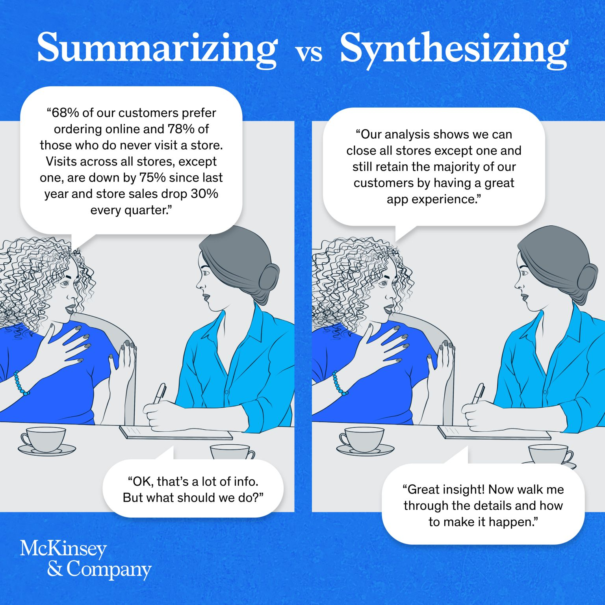
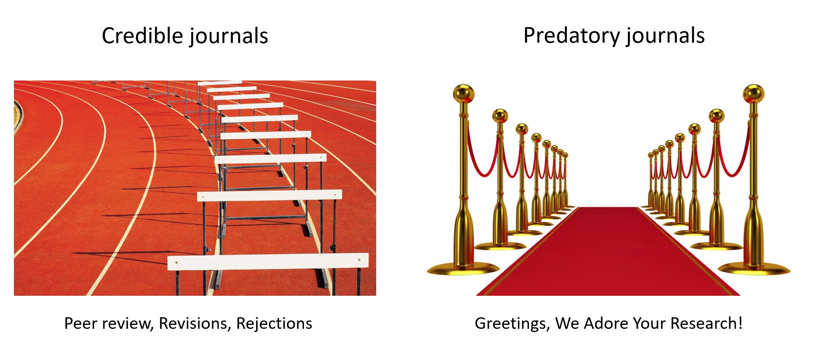
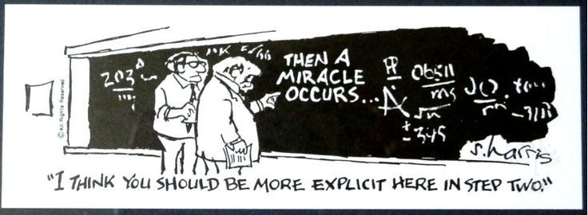
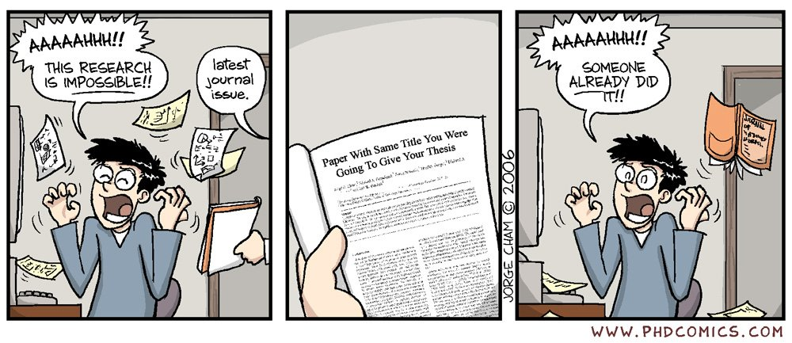
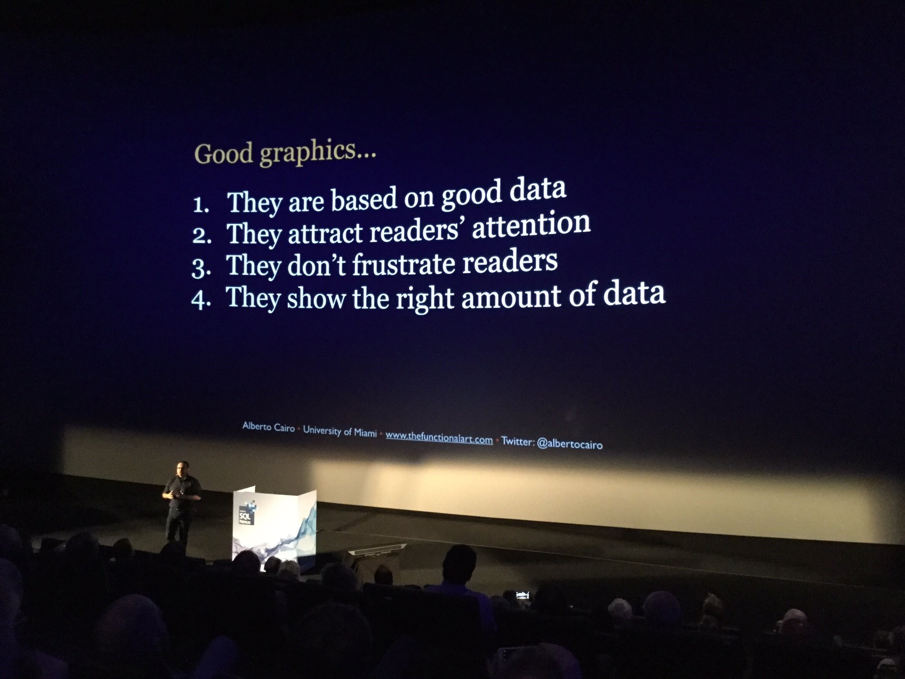

```{r echo=FALSE}
# This removes all items in environment. 
rm(list=ls())
```

\newpage

# `r fontawesome::fa("file-alt")` Project structure. {#sec-structure}

Your project will be formed by one single document. A typical project structure is formed by: title, abstract, introduction, literature review, methodology, results, conclusion, and references. Although this is the physical order of your document, we usually write it in different order. In my experience, you should start with the literature review as you need to understand what has been done in the past, then you start producing some basic results or preliminary analysis. Once you have some clear progress in these two sections you write the methodology, introduction, conclusion and the abstract. 


## Title and cover page.

The title normally changes and evolves during the supervision process. A good title has the relevant keywords that can help the reader to understand quickly and unambiguously what the project is about. A good title represents the whole contents. It is very common to start with one title and end up with a different one before the final submission. This is fine if the title really reflects the contents and the approach of the project. I recommend you to propose an early title as soon as possible and let it change depending on the progress of your work, new discoveries, and on my recommendations. Changing the title is not necessarily a sign of weak planning. A good advice is asking yourself: *Does the title accurately reflect the contents?* And if the answer is not a clear yes, then you will have to edit your title.

Your document also needs a cover page that includes your names, the name of your program, the name of your supervisor, the name of the university, and date. You probably have a cover page template given by the academic programme or university guidelines. 

## Acknowledgments. 

This section is entirely optional. Sometimes students are interested to write thankful notes for parents, friends, boyfriends, girlfriends, pets, and occasionally for his or her supervisor or other professors. You can write a unique section as a team, or divide it as one acknowledgment per team member. This is the only section that obviously needs no revision at all by myself.

## Abstract.

An abstract is a catchy text of 100 to 200 words that synthesize the entire document including the main results or findings. It aims to persuade readers to read the full document, it acts as a shop window, enticing people to step inside. This is why the abstract is normally written and rewritten close to the end of the document production. A good abstract is concise, succinct, and should be enough to get a pretty good and clear idea about what the research project is about without the need of reading the entire document. In fact, I argue that a potential reader can decide whether to read the whole document or not simply by reading the abstract. 

An abstract is not a summary of the introduction section, it is not an executive summary, it is rather a synthesis of the whole document. This is a good illustration to differentiate a summary from a synthesis.

```{r echo=FALSE, out.width="60%", fig.align="center"}

```

An abstract includes what is your paper/project about, why it is relevant, how did you do it, what did you find, and why your findings are important. The following is an example of a nice 95 words abstract by @fama1993common. Please note how effectively the authors communicate their influential contribution using a clear language and a straightforward writing style.

*This paper identifies five common risk factors in the returns on stocks and bonds. There are three stock-market factors: an overall market factor and factors related to firm size and book-to-market equity. There are two bond-market factors, related to maturity and default risks. Stock returns have shared variation due to the stock-market factors, and they are linked to bond returns through shared variation in the bond-market factors. Except for low-grade corporates, the bond-market factors capture the common variation in bond returns. Most important, the five factors seem to explain average returns on stocks and bonds.*

After reading this abstract, everyone would be clear about whether to continue reading or not depending on their own interests. 

The following points should always be featured.

**Purpose** This is where you explain ‘why’ you undertook this study. If you are presenting new or novel research, explain the problem that you have solved. If you are building upon previous research, briefly explain why you felt it was important to do so. This is your opportunity to let readers know why you chose to study this topic or problem and its relevance. Let them know what your key argument or main finding is.

**Study design/methodology/approach** This is ‘how’ you did it. Let readers know exactly what you did to reach your results. For example, did you undertake interviews? Did you carry out an experiment in the lab? What tools, methods, protocols or datasets did you use?

**Findings** Here you can explain ‘what’ you found during your study, whether it answers the problem you set out to explore, and whether your hypothesis was confirmed. You need to be very clear and direct and give exact figures, rather than generalise. It is important not to exaggerate or create an expectation that your paper do not fulfill. 

**Originality/value** This is your opportunity to make a clear and succinct case for the value of your results. It is a good idea to ask colleagues whether your analysis is balanced and fair and again, it is important not to exaggerate. You can also reflect on what future research steps could be.

I also recommend you to include a JEL (Journal of Economic Literature) classification system because it is a standard method of classifying scholarly literature in the field of economics (finance is a field within economics). This system is used to classify articles, dissertations, books, book reviews, and working papers in EconLit, and in many other applications. For further descriptions and examples, just Google the JEL Codes Guide. 

As an alternative, you may substitute the abstract by an executive summary of no more than one page long.

## Introduction.

The introduction typically contains and outline of an unresolved issue or problem to be addressed and the added value of your own approach. It also highlights the relevance of the topic, contains a description of what is known about the problem, a research question, aim or objective. Introductions tend to move from the general to the more specific and introduce readers to the research presented and its significance by providing some background context.

It is important to include the main results in a very early section of your research project like the abstract and/or the introduction because you must assume that the reader is lazy and impatient throughout your writing process. If you incorporate this assumption about your reader in your writing style you will be alright as this makes you think twice whether your explanations are clear and complete enough. Please be aware that if you include a synthesis of your results in this section, then you will have to complete the introduction in a late stage of your project. The introduction should be (ideally) nontechnical, appealing, engaging, and it should motivate the reader to continue reading your research paper with a marked interest and enthusiasm. 

In this section, it is convenient to define relevant terms or concepts included in your title, and describe your plan of organization (a brief description of the following sections). Defining the relevant terms or concepts is important because it will help you as an author to put the reader in the right context and prepare him or her to read your project. You should not assume that the reader understands very well the main terms or concepts, so this is why you are expected to elaborate them in the introduction. The relevant terms or concepts are normally incorporated in the title, so you can take the introduction as an opportunity to explain in detail your own project title. The introduction shapes reader expectations of what they will find on reading your project, so take care to deliver on what you say you will do in the introduction. This is why this section is the second most important part of the whole document (the first one is presumably the abstract), so you have to be prepared to review it and polish the text as much as necessary, be prepared to edit, delete, write, rewrite and even start over from scratch.

I recommend you to read introductions of other published research papers because this can help you to write yours as you might copy the writing style of experienced authors and replicate it in your own work. When writing the introduction, make use of words and phrases to indicate coverage: examines, presents, provides an overview, outlines, analyses, explores. And indicate the key message: demonstrates, highlights, provides insight into, argues.

Common mistakes that you must avoid in writing this section includes:

-	Take extracts of other sections of your project to fill out the introduction. This is not recommended because the text will end up being a Frankenstein document. Write original and unique paragraphs in every single section of your dissertation.
-	The introduction has many different writing styles. This is not recommended because it will be difficult to read and follow. Sometimes students work on a shared document and this is fine if you review and make sure the writing style is consistent throughout the document because otherwise your document will be very hard to read and understand. The reader should have the sense of unity or cohesion when reading your project. This is important because you are writing a document as a team, but the reader is an individual, so the document should be written in a very consistent style as if it were written by one single person.
-	Remember the introduction is not a summary of your work. The introduction is rather an opportunity to engage the reader and reveal why he or she should spend time reading your project. You are writing for your reader, not for you, not for your supervisor.
-	Confusing introduction. Sometimes you add many topics in the introduction that do not fully correspond to your own main objectives. If this happens, then the reader will be confused about what is your project about, the reader might misunderstand what is your main point. In order to avoid this, make sure that your introduction contents are very clearly and closely related to your main objectives. This will help you to avoid inconsistencies and confusions.
- You may also unintentionally announce that you do a lot of things in your project whereas you do less or different things. If this happens, the reader will be disappointed and confused.

## Literature review.

The literature review is a description of work that has already been published in a particular field or on a specific topic. In the literature review you discuss how your own problem has been tackled in the past by other researchers and how your approach fits, complement, innovate, or extend the current knowledge or evidence about the topic. The literature review provides a rationale for your research in terms of what has been done in the past. In this section you should demonstrate that you understand very well what others have done and that you are clear about how your own view and approach differs from theirs.

In the literature review you explain how your project makes a clear contribution. You will need to support your own work based on some references related with your project and these references are expected to be published in recognized research papers. Not only that, I recommend that your references are from high-quality journals according to the Chartered Association of Business Schools (three stars and above), or SJR (Scientific Journal Rankings). Published papers in high-quality journals are not the most difficult to understand, they are simply the more interesting, the ones with significant impact in the field, the ones that concentrate the most significant contributions, and the ones in which you will find the most influential authors. 

To establish your credibility, your literature review will typically need to do at least some (if not all) of the following effectively.

-	Demonstrate that your research is rigorous and up-to-date by engaging with seminal and current work.
-	Summarize relevant bodies of work and evaluate their strengths and weaknesses to demonstrate your critical understanding of the literature.
-	Point out gaps in the literature or identify problems, issues remaining to be solved.
-	Highlight key issues essential to your own research.
-	Synthesize the main themes and arguments of a particular body of literature.
-	Produce a brief historical survey or other context information in order to situate your research.
- Avoid list and paraphrase the content of the papers involved. Your review should show evidence of evaluation, and explore relationships between the material so that key themes emerge.

At the beginning, you might have some difficulties at finding those papers that you need to include in the literature review section. This is perfectly normal, do not feel too bad about it. There are many ways to start your search for literature including the university electronic library. However, my first recommendation here is to use the Google Scholar site (it must be the “scholar” site), this site allows you to look for published papers in a specific time frame, find papers of specific authors, and even look for papers that has a specific paper as a reference (forward looking). This is, if you find a good 2020 paper, you can ask Google Scholar to show 2021 to 2024 papers that includes the 2020 paper in their reference section, which is nice and useful. Please spend some time on Google Scholar and get familiar with this search engine designed to help researchers. 

An additional difficulty you might face is to know which paper is good and which one is not for your literature review. My recommendation here is to start with a simple search, download a few documents and read them. You will soon realize that you may understand some things and you might not understand others, but that is fine and you have to keep reading and see how other authors have approached similar objectives like yours. Reading others will help you to see how they explain their own research and you could learn from that as well. When you find a good paper for your own, then it is a good idea to look at that paper references section (backward search, older papers); and look for other papers that have reference to this good paper (forward search, newer papers). Bear in mind that this section is not supposed to include all that you read; you have to incorporate only the relevant papers and references that are important to understand the nature of your own project. 

Common mistakes in writing this section includes:

-	Write about every single document that you found. This is not recommended as you are expected to include the papers that are more closely related with your own objectives or approach. The journey to find the right papers is not that important, what is important is the definite set of papers that are clearly related with your own research project. 
-	Start your literature review with a 1900 paper. This is usually not recommended because you will never end. Plus, we assume that the main relevant set of papers of a given current topic already incorporates previous years literature. A typical rule of thumb could be to read papers published in the past 10-15 years or so.
-	Remember that every paper referenced in the project must be in the reference section and every paper listed in the reference section has to be referenced in the project. So please do this double check. Although, you may not face this issue if you use Quarto within RStudio.
-	Avoid using the footnotes as a substitute to the reference section. In fact, avoid using footnotes in general, if it is outside the main body, it probably does not deserve to be included at all. 
-	Avoid (if possible) organize this section according to a historical approach. The time is normally not an appropriate approach because this is not a section about the strict chronological evolution of a given topic. Instead, this is about how a specific problem has been addressed in the past: you can start commenting about a 2016 paper and then a 2010 paper, and then a 2018 paper and that is fine. Therefore, you will have to figure out a logical way to present and comment about the selected papers, and this logical way is not necessarily time. The challenge here is to find out this coherent approach to develop your literature review. In Spanish we use the word *hilo conductor* to refer to this specific issue, just Google it. 
-	Another common mistake is to superficially report what you read. This is because reporting your reading requires a minimum intellectual effort. Instead, you must summarize, compare, contrast, analyze, explain, and evaluate others’ published work. This is more challenging and requires some research-skills. 
-	Copy and paste from others research papers must be avoided by all means. Your dissertation requires you to produce original text all the time. If you consider you are incapable of writing original text, then this is a clear sign that you have not read enough.
-	There are many low-quality journals out there that accept almost any kind of paper for publication for a fee. The point here is to incorporate in your project a set of serious authors, serious journals. Also, if you are interested in getting published, I normally recommend my students to get away from these predatory journals. Google the concept of predatory journals to see the kind of damage that they cause to research and academia in general.

```{r echo=FALSE, out.width="70%", fig.align="center"}

```

-	If you do not find relevant literature, then the most likely reason is that you have not performed a good search. In other words, there is relevant literature out there, you just have to learn how to find them. Also, you might be looking for a topic which is so specific that you will have difficulties finding papers. In this case, try one degree less specific and you will find interesting literature.
-	Avoid using references such as blogs, newspaper extracts, isolated quotes, Wikipedia, and other kind of source that do not follow a strict scientific method or do not follow a professional peer-review process. You are free to read those, but you are not expected to trust them to the point of incorporating them as a reference in your dissertation.

If your topic is widely discussed by the literature is good because you may select the most interesting papers to include in your literature review. On the other hand, if it is not, then you may not be looking correctly or you may have an innovative topic. This is also good because you may select the most interesting approach to contribute to the literature.

## Methodology.

Your project will most likely include an empirical test, a valuation, data analysis, or model estimation so the methodology will provide a detailed assessment of the quantitative methods and data used in your project. The methodology section includes the model presentation, assumptions, equations, functions, and relevant estimation techniques. Math notation must be properly formatted by using the insert-equation feature available in MS-Word, markdown or in $\LaTeX{}$. 

The equations are supposed to be well formatted like this:
$E_0=V_0N(d_1)-De^{-rT}N(d_2)$.

This section must be very clear to the extent that someone could be able to replicate your own results simply by following this section. If this condition does not hold, then this section could be considered as incomplete. The methodology section also includes the description and source of the raw data used in the empirical exercise. You will have to indicate the software used and the version; in the case of R you are supposed to use: R Core Team (2024). R: A language and environment for statistical computing. R Foundation for Statistical Computing, Vienna, Austria. URL https://www.R-project.org/ It is not compulsory to reveal your R code but you are expected to provide all your methodological procedure and explain it very well.

```{r echo=FALSE, out.width="70%", fig.align="center"}

```

One common mistake is to include procedures, equations or tests that are not used in the results section. 

## Results. 

Are the results well-presented and have they been correctly interpreted? Is the analysis sufficiently rigorous? These are the typical questions that are expected to be addressed in the results section. 

This section includes tables, plots, interactive plots, diagrams, graphs, and other complementary tools to show the results that will help you to meet your initial objectives, contrast your main hypothesis, and answer your research question as clearly, as explicit, and as complete as possible. This section will show the quality of the execution of the empirical exercise and methodology. Please bear in mind that the whole project should have clearly defined numbered sections and subsections. The equations, tables and figures should be properly numbered as well for an easier reference.

Here are four versions of the same set of results or data.

```{r}
library(MASS)
m <- 2 # number of firms
n <- 10000 # number of simulations
rho_pos02 <- 0.2 # correlation
corr_pos02 <- matrix(rep(rho_pos02, m * m), m, m) # correlation matrix
diag(corr_pos02) <- 1
set.seed(130575)
x2 <- mvrnorm(n, mu = rep(0, m), Sigma = corr_pos02)
x2 <- data.frame(x2)
colnames(x2) <- c("f1", "f2")
```

For illustrative purposes, this is a 10,000 simulation of a multivariate normal distribution.

```{r fig.cap="A simple graph using the plot() funcion in R."}
par(pty = "s") # Figures are shown in a perfect square (not a rectangle).
plot(x2, pch = ".", cex = 1) 
legend("bottomright", legend = c(paste(nrow(x2))), bty = "n")
```

A density view.

```{r fig.cap="A density view using ggplot() function in R."}
library(ggplot2)
ggplot(x2, aes(x = f1, y = f2) ) +
  stat_density_2d(aes(fill = ..level..), geom = "polygon", 
                  colour = "white") +
    coord_fixed()
```

This is the 3-D <tt>`rayshader`</tt> video version of the plot above.

```{r}
library(vembedr)
embed_url("https://youtu.be/3p-B19R8RwA")
```

And a fourth interactive version.

```{r fig.cap="An interactive view."}
library(mnormt)
library(tidyverse)
library(plotly)
f <- function(x, y) dmnorm(cbind(x, y), c(0, 0), corr_pos02)
z <- outer(sort(x2[1:100,1]), sort(x2[1:100,2]), f)

plot_ly(type = "surface" , x = sort(x2[1:100,2]), 
        y = sort(x2[1:100,1]) , z = z ) %>%
layout(#title = "Surface",
       scene = list(xaxis = list(title = "f1", range = c(-2,2)),
                    yaxis = list(title = "f2", range = c(-2,2)), 
                    zaxis = list(title = "Density"))) %>%
hide_colorbar()
```

You can see other results/figures examples related with risk management and credit risk here: @lozanoARF; financial econometrics, time series and machine learning here: @lozanoEMF; financial options and VaR here: @lozanoIF; and financial modeling here: @lozanoPMF.

If your abstract is good enough, people would most likely scroll down your paper to see your results. The design of your tables and graphs is expected to be as good to the extent that they would virtually need no explanation. In other words, they are expected to be almost self-explanatory and they must be free of any sort of confusing elements. The main challenge of this section is to organize your results in such a way that your reader will perfectly understand how these results help you to meet the original research question, evaluate your original hypothesis and objectives. Sometimes your introduction has to be altered given your results; this is OK as long as this contributes to strengthening your project by making it more consistent.

Normally, I recommend trying to think in a comic-oriented approach. This is, you will have to produce your figures and tables in such a way that they could be able to tell the story that you are interested to communicate. After producing the main figures and tables in the right order, then the process of explaining the results (or tell your story) becomes easier.
 
```{r echo=FALSE, out.width="70%", fig.align="center"}

```

Typical mistakes in this section are:

-	To include tables or plots that are difficult to relate to your original objectives. This will create confusion because the reader will not understand how these results help to address the main research questions. 
-	Include results that are difficult to read because the font is too small or the format is hard to understand. 
-	Include tables or plots from other authors. You are expected to show the main original results in this section, so taking results from other authors sends a very wrong signal to the reader.
-	Fail to explain and interpret every single table and plot. You must remember that you are the one who is supposed to explain your results, not the reader.
 
```{r echo=FALSE, out.width="70%", fig.align="center"}

```

You may also include an excessive amount of preliminary results, or you may get lost in the process and forget about your own declared objectives. 

## Discussion of results (optional).

This section will allow you to elaborate your analysis further and deeper. I usually argue that the uniqueness of your project relies on your approach, and the quality of your project relies mostly on the quality of your analysis, and I believe this section is where most of the deep analysis is done. Remember your reader is supposed to be lazy, so your reader needs you to explain your own results in an extremely detailed and specific way, so do not expect the reader to interpret your results by himself or herself, or read your mind. Interpretations, implications, explanations, and discussions are supposed to be elaborated in detail in this section. 

I insist that the quality of your project will rely very much on the quality of your discussion of your own results, their implications, and the significance of your own and original findings with respect to the current literature. Here, my advice is to always read your work out loud, to yourself, parents or even to your pets. This is the best way to put you in the shoes of your reader. By doing this, you will clearly identify what you must delete, delete again, change order, write, rewrite, edit or simply start over again. The worst that can happen here is that your reader fails to understand you, and if this happens then the reader will no longer be interested in your work and will most likely consider it wrong or not worth the time.

## Complementary results (optional).

These are normally useful to incorporate some extra consistency tests to evaluate whether your results are consistent and robust with different data-sets or different parameters in the experimental design. Not every thesis needs complementary results. Also, these might not represent the main core of your results, but they will complement your thesis and strengthen your conclusions.

## Conclusion.

Here you draw together your key findings and tell readers what you think it all means. The conclusion will summarize your main results and elaborate on the future steps that you or someone else could take in order to explore your research question further. The conclusion is a good opportunity to move from a detailed to a general level of consideration that returns the topic to the context provided by the introduction, so in the conclusion you close the circle that started in the introduction. You might also suggest further research; this could reveal some good understanding about the scope, extensions, and limitations of your own project. The conclusion is not the same as the abstract. The conclusion might not make full sense by itself if you read it isolated. However, the abstract can be fully understandable without the need of reading the rest of the document. The conclusion should answer the question: what did you learn?

When reporting on your findings, however, do not merely list or repeat them from previous sections. Doing so gives no insight into the meanings you attach to these findings. Rather, draw together all findings into a coherent whole, and think about the weight and significance you attach to these findings in terms of your research objectives or questions. As not all findings will be equally important, you might want to think about them in terms of a scale of significance. Ask yourself the following questions.

-	What do I consider most important about my findings in general and why?
-	Which findings seem to be of greater or lesser significance and why?
-	Are there any specific findings to which I want to draw particular attention and why?
-	Is there anything unusual about any of my findings needing special mention and why?
-	Has my methodology or anything else affected my interpretation of findings and is this something that needs to be discussed?
-	Any other questions important for your research?

Avoid the following mistakes:

- Start a new topic or introduce new material.
- Repeat the introduction.
- Make obvious statements. 
- Contradict anything you said earlier.

## References.

This section should include every article, paper, book that you use to support your project. In the same way, every referenced article, paper, and book used in the project should be in the references section. 

There are several formats you can follow to write this section. Some journal articles and books may have different formats and this might be confusing. My simple recommendation here is to just follow the APA style, there are many online resources that can help you to know more about the APA style. In fact, the university library can provide useful advice in this respect. Google Scholar has a nice feature that allows you to copy the reference of the paper in several formats including APA, ISO 690, MLA, Bib$\TeX{}$, EndNote, RefMan and RefWorks.

In Bib$\TeX{}$, a typical <tt>`.bib`</tt> file has entries like:

<tt>`@article{fama1993common,`</tt>
<tt>`  title={Common risk factors in the returns on stocks and bonds},`</tt>
<tt>`  author={Fama, Eugene F and French, Kenneth R},`</tt>
<tt>`  journal={Journal of financial economics},`</tt>
<tt>`  volume={33},`</tt>
<tt>`  number={1},`</tt>
<tt>`  pages={3--56},`</tt>
<tt>`  year={1993},`</tt>
<tt>`  publisher={Elsevier}`</tt>
<tt>`}`</tt>

And every time you write `@fama1993common` you will get the correspondent reference @fama1993common in the compiled file.

Understanding how to reference can be very helpful to avoid academic malpractice. There should be some student guidelines about academic malpractice regulations and how to avoid it. I recommend you to read those and contact me in case you need further assistance.
