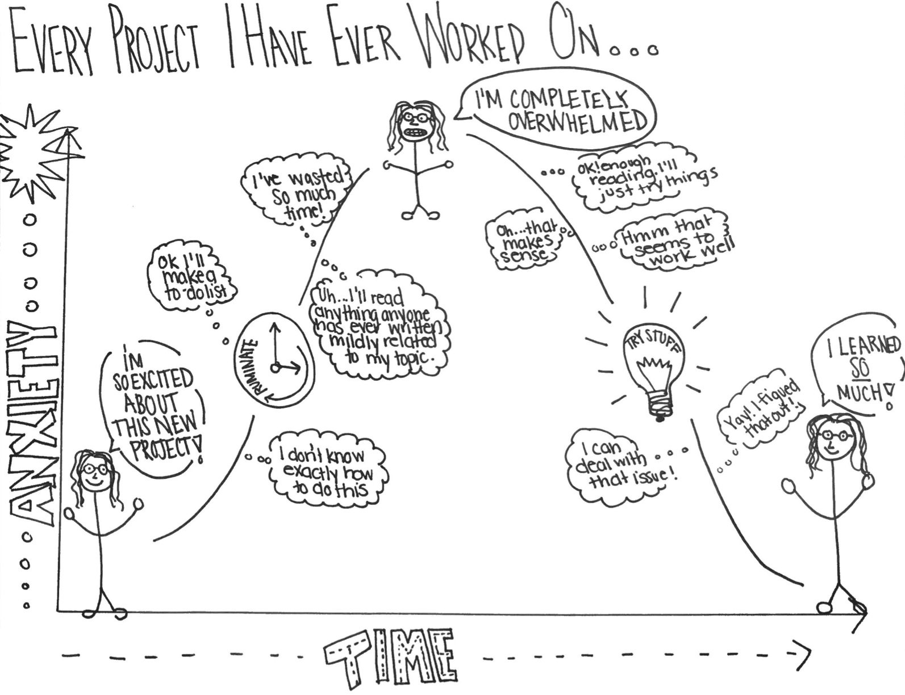

```{r echo=FALSE}
# This removes all items in environment. 
rm(list=ls())
```

\newpage

# `r fontawesome::fa("user-edit")` Writing style.

Writing should be a constant process – start now – do not wait until you have done all your research. Also, remember you must be prepared to edit your writing several times before it is ready. 

The writing style is important because you might have a great idea but if you fail to communicate effectively nobody will take you seriously. Alternatively, you might have a regular idea but you are very convincing and you communicate it very well then everybody will listen to you. This section can help you understand the required writing style you have to use in your project.

Group projects can provide particular interpersonal challenges, as teams cope with difference of views, non-performing team members etc., and particular problems can arise at the writing stage. If you split up the sections among different people, then you will get different writing styles and even ideas about what the report is about. Ways of ensuring consistency includes swapping around writing and editing, so that the text gets seen by a different pair of eyes, or having an overall ‘master editor’.

**Avoid using several and mixed verb tenses.** I recommend you to use the simple present tense in most of your document. Keep the writing simple, straight, and clear. Complicated writing is often confusing. Sometimes the student thinks that a complex text is more formal or elegant and this is the opposite. Complex writing makes you sound small-minded. Simpler text is often more difficult to achieve but it is preferred in terms of clarity. Use past and future tense only in very limited cases and avoid contractions.

**Use the active voice.** In English, readers prefer the SVO sentence sequence: subject, verb, object. This is the active voice. For example: Passive sentences bore people. When you reverse the active sequence, you have the OVS or passive sequence: object, verb, subject. For example: People are bored by passive sentences. You cannot always use the active voice, but most writers should use it more often. In short, the more you read the better you write. In academic writing this applies very well, your writing will improve considerably if you consciously read high quality published papers. My recommendation is to use active voice.

**Detail.** You are expected to write detailed explanations of what you are doing in your project. Most of the times when I review your drafts, I insist on this point several times. You must motivate and introduce every idea, explain it fully, elaborate on the nature of your objectives, and be very explicit in your methodology. You must show how well you understand the topics in your project and a detailed discussion helps you to achieve this objective. Consider the following example: (1) I grow lots of flowers in my backyard; (2) I grow 34 varieties of flowers in my backyard, including pink coneflowers, purple asters, yellow daylilies, Shasta daisies, and climbing clematis. Clearly (2) is more interesting than (1) simply because more details are provided and I can even imagine your backyard very clearly.

**Clarity.** This refers to the quality of coherence and intelligibility. You need to make sure your idea is clearly communicated. Sometimes sentences and paragraphs are not very well connected and this leads to some confusion about what is your main point. In this case, you will have to review your text and make sure every single sentence and paragraph are effectively contributing to communicating the idea correctly. Write use instead of utilize, near instead of close proximity, help instead of facilitate, for instead of in the amount of, start instead of commence.

**Paragraph structure.** A good paragraph contains only one major point of discussion. All the sentences in the paragraph should relate to this one idea and should flow from one another. If you read one sentence aloud and you need to pause for breath, insert a comma.

**Write clear sentences.** One golden rule for clarity is that a sentence should be easy to understand the first time you read it. If it is not, then think about restructuring it or splitting it in two.

**Avoid illogicalities and errors in reasoning.** These include contradicting something you said in one paragraph in the next (or even the same paragraph), complete jumps of sense between or within paragraphs, so that one statement does not follow on from another, deducing incorrect conclusions from evidence.


**Avoid wordiness.** Delete any words which do not add to the meaning. Some words may be correct grammatically, but they do not really add anything to the sentence.

Reduce wordy verbs.

-	From *is aware, has knowledge of*, to simply: *knows*.
-	From *is taking*, to simply: *takes*.
-	From *are indications*, to simply: *indicate*.
-	From *are suggestive*, to simply: *suggests*.

**Coherence.** This is about being logical and consistent in your writing. It is worthwhile to constantly question yourself whether your paragraph or section makes sense or not. If not, you will have to work on your coherence. Coherence is about confirming that the structure of your manuscript is logical and your meaning is clear. 

**Cohesion.** This is about forming a united whole. Sometimes four team members contribute to writing a specific section and it turns out that the section lacks of cohesion because it looks as different views and unarticulated paragraphs. You will have to make sure your text is in fact a unity. Words and phrases can control and order the logic within a paragraph's argument. You can link ideas using words that show a logical relationship: therefore, however, but, consequently, thus, even so, conversely, nevertheless, moreover, in addition, and many more. Whatever its form, an intra-paragraph transition should be unobtrusive, shifting readers easily from one topic to the next. 

**Flow.** Your reader should be able to follow your line of discussion, see how you are moving your discussion from one topic to the next in developing your overall point of view. In other words, paragraphs should be properly linked to ensure coherence. 

There is an interesting and relevant recommendation by Gary Provost about academic writing. This summarize very well how you are expected to write:

*This sentence has five words. Here are five more words. Five-word sentences are fine. But several together become monotonous. Listen to what is happening. The writing is getting boring. The sound of it drones. It’s like a stuck record. The ear demands some variety. Now listen. I vary the sentence length, and I create music. Music. The writing sings. It has a pleasant rhythm, a lilt, a harmony. I use short sentences. And I use sentences of medium length. And sometimes, when I am certain the reader is rested, I will engage him with a sentence of considerable length, a sentence that burns with energy and builds with all the impetus of a crescendo, the roll of the drums, the crash of the cymbals–sounds that say listen to this, it is important.*

# `r fontawesome::fa("exclamation-circle")` What might go wrong?

Many things might go wrong, but if we know them and consider them in advance then this risk can be properly managed (or avoided). One of the main risks is that you start losing interest in your project because of your current job or any other sort of new or unanticipated responsibilities. The kind of commitment that you have with your team and your supervisor demands a constant and a high interest throughout the whole process. My recommendation in this respect is that you always keep track of this document to evaluate your progress in a timely manner and always keep me informed about your progress.
 
```{r echo=FALSE, out.width="70%", fig.align="center"}

```

You can also get frustrated by not meeting my quality standards, or by not understanding a specific topic, or by not overcoming a specific academic challenge. I am not going to actively promote negative feelings like frustration but if it happens, then you should overcome this as well and as quickly as you can. Frustration is not good, but if you feel it then try to transform it into an extra motivation to achieve the objective. Do not let frustration paralyse your progress, and do not let it last for long. I consider there is no challenge that you cannot overcome, you just have to allocate the right amount of time and effort. Ideally, you are supposed to enjoy the process of writing your project and overcoming challenges feels good.

You could even ignore this document and that is unfortunate because this document is designed to assist you in the whole project. This document could contribute to work more efficiently, avoid potential risks, and help you to get things on the right track. 

On the positive side, many other things might go well. I am confident that the negative issues can be easily and quickly be managed and you can progress well most of the time. 

# `r fontawesome::fa("check-square")` Checklist.

Below you can find a useful checklist to bear in mind while working on your thesis project.

1. Keep me informed about your progress and do it regularly. The best way to approach me is by email.
2. Make sure you are clear about what you are expected to do in the short run and in the medium run. This guide can shed some light about this.
3. Make sure you fully and clearly understand my feedback, meetings agreements, comments, recommendations, advice, etc. If you do not understand this, then you have to ask me for clarification. Contact me for any concern you might have.
4. If I ever take longer than expected to answer an email, or review a draft, please insist and kindly remind me. 
5. Do not wait for further instructions passively. You are expected to ask for new and further instructions in case you do not know what you are supposed to do.
6. Always keep quality standards high for your own work and overall performance. 
7. Read this document on a regular basis as a guide and reference. You are expected to be able to achieve some sort of independence by following this guide closely. 
8. Never get frustrated because there will be no challenge that you can overcome with the right amount of time and effort. If after all you get frustrated, upset, or angry do not let it happen too frequently and do not let it last for long. 
9. Follow number 1. 

# `r fontawesome::fa("smile")` Conclusion.

I hope you find this process a rewarding learning experience for you. Remember that part of my time, my knowledge, interest, and experience are currently at your service.

